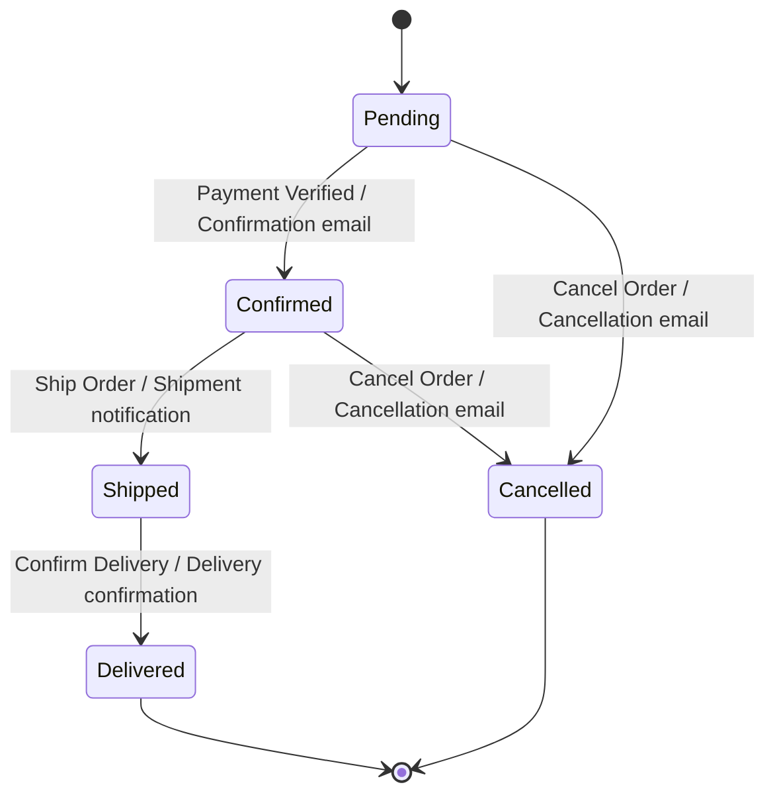

# Example: E-Commerce Order Lifecycle

## Scenario

**Feature:** Order management system — order status lifecycle  
**Business Rules:**

- **BR-001:** A new order starts in **Pending** status upon successful checkout submission.
- **BR-002:** An order in Pending status can be **Confirmed** by the system after payment is verified. Upon confirmation, a confirmation email is sent to the customer.
- **BR-003:** An order in Pending status can be **Cancelled** by the customer. A cancellation email is sent. Cancelled is a terminal status.
- **BR-004:** An order in Confirmed status can be **Shipped** when the warehouse dispatches the package. A shipment notification email is sent with tracking number.
- **BR-005:** An order in Confirmed status can be **Cancelled** by the customer, but only if it has NOT yet been shipped. A cancellation email is sent.
- **BR-006:** An order in Shipped status can be **Delivered** when the courier confirms delivery. A delivery confirmation email is sent.
- **BR-007:** An order in Shipped status **cannot be cancelled** — the shipment is already in transit.
- **BR-008:** An order in Delivered status is terminal — no further status changes are permitted.
- **BR-009 (implied):** Any event applied to an order in Cancelled or Delivered status must be rejected with an appropriate error message.
- **BR-010 (implied):** A Pending order cannot be Shipped or Delivered — it must be Confirmed first.

**Coverage target:** All Transitions (0-switch) + All Invalid Transitions — standard commercial application baseline.

## Step 1 — Identify FSM Components

### States

| State ID | State Name | Description                             | Entry Condition                         | Source         |
| -------- | ---------- | --------------------------------------- | --------------------------------------- | -------------- |
| S1       | Pending    | Order created, payment not yet verified | Checkout submitted                      | BR-001         |
| S2       | Confirmed  | Payment verified; order accepted        | Payment gateway returns success         | BR-002         |
| S3       | Shipped    | Package dispatched by warehouse         | Warehouse marks as shipped              | BR-004         |
| S4       | Delivered  | Package received by customer            | Courier confirms delivery               | BR-006         |
| S5       | Cancelled  | Order terminated before shipment        | Customer cancels (Pending or Confirmed) | BR-003, BR-005 |

**Initial pseudostate:** ● → S1 (Pending) upon checkout submission  
**Final states:** S4 (Delivered), S5 (Cancelled)

### Events

| Event ID | Event Name       | Type            | Trigger                               | Source         |
| -------- | ---------------- | --------------- | ------------------------------------- | -------------- |
| E1       | Payment Verified | System/External | Payment gateway returns approval      | BR-002         |
| E2       | Cancel Order     | User action     | Customer requests cancellation        | BR-003, BR-005 |
| E3       | Ship Order       | System/Admin    | Warehouse marks package as dispatched | BR-004         |
| E4       | Confirm Delivery | System/External | Courier API confirms delivery         | BR-006         |

### Guard Conditions

None.

### Actions

| Action ID | Description                                  | Observable Indicator                                       | Triggered By                                     |
| --------- | -------------------------------------------- | ---------------------------------------------------------- | ------------------------------------------------ |
| A1        | Send confirmation email                      | Email received by customer; order.status = CONFIRMED in DB | T1 (Pending→Confirmed)                           |
| A2        | Send cancellation email                      | Email received by customer; order.status = CANCELLED in DB | T2 (Pending→Cancelled), T3 (Confirmed→Cancelled) |
| A3        | Send shipment notification with tracking     | Email with tracking number; order.status = SHIPPED in DB   | T4 (Confirmed→Shipped)                           |
| A4        | Send delivery confirmation email             | Email received; order.status = DELIVERED in DB             | T5 (Shipped→Delivered)                           |
| A5        | Display error: "Order cannot be modified"    | Error response returned; order.status unchanged            | All invalid transitions from final states        |
| A6        | Display error: "Cannot cancel shipped order" | Error response returned; order remains SHIPPED             | Invalid: Cancel from Shipped                     |

## Step 2 — Construct the State Transition Diagram (STD)

**Labeled transition list:**

```
STATES: S1 (Pending), S2 (Confirmed), S3 (Shipped), S4 (Delivered), S5 (Cancelled)
INITIAL: ● → S1
FINAL: S4, S5

VALID TRANSITIONS:
● → S1  : [unconditional] / Create order record
S1 → S2 : E1: Payment Verified / Send confirmation email; order.status = CONFIRMED
S1 → S5 : E2: Cancel Order / Send cancellation email; order.status = CANCELLED
S2 → S3 : E3: Ship Order / Send shipment notification; order.status = SHIPPED
S2 → S5 : E2: Cancel Order / Send cancellation email; order.status = CANCELLED
S3 → S4 : E4: Confirm Delivery / Send delivery confirmation; order.status = DELIVERED
```

**Mermaid representation:**



**STD completeness checks:**

- [x] All 5 states reachable from initial pseudostate ✓
- [x] All non-final states (S1, S2, S3) have outgoing valid transitions ✓
- [x] S4 and S5 are final — no outgoing valid transitions ✓
- [x] No self-transitions in this lifecycle (no event causes a state to remain in the same state) ✓
- [x] All transitions fully labeled ✓
- [x] Initial pseudostate has no incoming transitions ✓

## Step 3 — Construct the State Transition Table (STT)

**Grid:** 5 states × 4 events = 20 cells total

**Compact format:**

| Current State     | E1: Payment Verified                  | E2: Cancel Order                           | E3: Ship Order                       | E4: Confirm Delivery                 |
| ----------------- | ------------------------------------- | ------------------------------------------ | ------------------------------------ | ------------------------------------ |
| **S1: Pending**   | S2 / Confirmation email sent          | S5 / Cancellation email sent               | — / Error: "Order not confirmed yet" | — / Error: "Order not confirmed yet" |
| **S2: Confirmed** | — / Error: "Payment already verified" | S5 / Cancellation email sent               | S3 / Shipment notification sent      | — / Error: "Order not yet shipped"   |
| **S3: Shipped**   | — / Error: "Order already confirmed"  | — / Error: "Cannot cancel a shipped order" | — / Error: "Order already shipped"   | S4 / Delivery confirmation sent      |
| **S4: Delivered** | — / Error: "Order is closed"          | — / Error: "Order is closed"               | — / Error: "Order is closed"         | — / Error: "Order is closed"         |
| **S5: Cancelled** | — / Error: "Order is cancelled"       | — / Error: "Order is already cancelled"    | — / Error: "Order is cancelled"      | — / Error: "Order is cancelled"      |

**Valid transitions (6):** T1, T2, T3, T4, T5, T6 (highlighted above with destination state)  
**Invalid transitions (14):** All remaining cells

**Expanded format for invalid transitions (key ones):**

| Current State | Event       | Valid? | Destination State | Expected Response                                       | Source |
| ------------- | ----------- | ------ | ----------------- | ------------------------------------------------------- | ------ |
| S3: Shipped   | E2: Cancel  | N      | —                 | Error: "Cannot cancel a shipped order; contact support" | BR-007 |
| S4: Delivered | Any         | N      | —                 | Error: "Order is finalized and cannot be modified"      | BR-008 |
| S5: Cancelled | Any         | N      | —                 | Error: "Order is cancelled and cannot be modified"      | BR-009 |
| S1: Pending   | E3: Ship    | N      | —                 | Error: "Order must be confirmed before shipping"        | BR-010 |
| S1: Pending   | E4: Deliver | N      | —                 | Error: "Order must be confirmed before delivery"        | BR-010 |

## Step 4 — Coverage Plan and Test Paths

**Coverage selected:** All Transitions (0-switch) + All Invalid Transitions  
**Rationale:** Standard commercial e-commerce application; financial transactions involved; full coverage of both valid and invalid paths required.

### Valid Transitions to Cover

| Transition ID | From          | Event                | To            | Action                |
| ------------- | ------------- | -------------------- | ------------- | --------------------- |
| T1            | S1: Pending   | E1: Payment Verified | S2: Confirmed | Confirmation email    |
| T2            | S1: Pending   | E2: Cancel           | S5: Cancelled | Cancellation email    |
| T3            | S2: Confirmed | E3: Ship             | S3: Shipped   | Shipment notification |
| T4            | S2: Confirmed | E2: Cancel           | S5: Cancelled | Cancellation email    |
| T5            | S3: Shipped   | E4: Confirm Delivery | S4: Delivered | Delivery confirmation |

**Total valid transitions: 5**

### Invalid Transitions to Cover

| IT ID | From State    | Event                | Expected Response                      |
| ----- | ------------- | -------------------- | -------------------------------------- |
| IT-01 | S1: Pending   | E3: Ship Order       | Error: "Order must be confirmed first" |
| IT-02 | S1: Pending   | E4: Confirm Delivery | Error: "Order must be confirmed first" |
| IT-03 | S2: Confirmed | E1: Payment Verified | Error: "Payment already verified"      |
| IT-04 | S2: Confirmed | E4: Confirm Delivery | Error: "Order not yet shipped"         |
| IT-05 | S3: Shipped   | E1: Payment Verified | Error: "Order already confirmed"       |
| IT-06 | S3: Shipped   | E2: Cancel Order     | Error: "Cannot cancel a shipped order" |
| IT-07 | S3: Shipped   | E3: Ship Order       | Error: "Order already shipped"         |
| IT-08 | S4: Delivered | E1: Payment Verified | Error: "Order is finalized"            |
| IT-09 | S4: Delivered | E2: Cancel Order     | Error: "Order is finalized"            |
| IT-10 | S4: Delivered | E3: Ship Order       | Error: "Order is finalized"            |
| IT-11 | S4: Delivered | E4: Confirm Delivery | Error: "Order is finalized"            |
| IT-12 | S5: Cancelled | E1: Payment Verified | Error: "Order is cancelled"            |
| IT-13 | S5: Cancelled | E2: Cancel Order     | Error: "Order already cancelled"       |
| IT-14 | S5: Cancelled | E3: Ship Order       | Error: "Order is cancelled"            |
| IT-15 | S5: Cancelled | E4: Confirm Delivery | Error: "Order is cancelled"            |

**Total invalid transitions: 15** (20 cells − 5 valid = 15 invalid)

### Test Path Design

**Path optimization:** T1→T3→T5 can be chained into one journey (full happy path). T2 and T4 require separate paths (both lead to final state S5; T4 requires passing through S2 first). Invalid transitions require individual test cases.

| TC ID | Path Description                                     | Transitions Covered        | Type                     |
| ----- | ---------------------------------------------------- | -------------------------- | ------------------------ |
| TC-01 | Full happy path: Pending→Confirmed→Shipped→Delivered | T1, T3, T5                 | Valid (multi-transition) |
| TC-02 | Cancel from Pending                                  | T2                         | Valid                    |
| TC-03 | Confirm then Cancel (before shipping)                | T1, T4                     | Valid (multi-transition) |
| TC-04 | Ship to Pending order (invalid)                      | IT-01                      | Invalid                  |
| TC-05 | Deliver to Pending order (invalid)                   | IT-02                      | Invalid                  |
| TC-06 | Re-verify payment on Confirmed order (invalid)       | IT-03                      | Invalid                  |
| TC-07 | Deliver to Confirmed order (invalid)                 | IT-04                      | Invalid                  |
| TC-08 | Re-verify payment on Shipped order (invalid)         | IT-05                      | Invalid                  |
| TC-09 | Cancel a Shipped order (invalid)                     | IT-06                      | Invalid                  |
| TC-10 | Re-ship a Shipped order (invalid)                    | IT-07                      | Invalid                  |
| TC-11 | Any event on Delivered order (invalid)               | IT-08, IT-09, IT-10, IT-11 | Invalid                  |
| TC-12 | Any event on Cancelled order (invalid)               | IT-12, IT-13, IT-14, IT-15 | Invalid                  |

**Total: 12 test cases** covering 5 valid transitions + 15 invalid transitions.

## Step 5 — Test Case Suite

### TC-01: Full Happy Path — Pending → Confirmed → Shipped → Delivered

| Field            | Content                                                                                              |
| ---------------- | ---------------------------------------------------------------------------------------------------- |
| **TC ID**        | TC-01                                                                                                |
| **Description**  | Complete order lifecycle: payment verified, order shipped, delivery confirmed                        |
| **Precondition** | System has an order in **S1: Pending** status. Order ID: ORD-001. Customer email: customer@test.com. |
| **Coverage**     | Valid transitions: T1 (Pending→Confirmed), T3 (Confirmed→Shipped), T5 (Shipped→Delivered)            |

| Step | Action / Event               | Input Data                                                          | Expected Result                                                                | Post-Step State |
| ---- | ---------------------------- | ------------------------------------------------------------------- | ------------------------------------------------------------------------------ | --------------- |
| 1    | Trigger E1: Payment Verified | `order_id="ORD-001"`<br>`payment_status="SUCCESS"`                  | order.status = CONFIRMED in DB; confirmation email sent to `customer@test.com` | S2: Confirmed   |
| 2    | Trigger E3: Ship Order       | `order_id="ORD-001"`<br>`tracking_number="TRK-9876"`                | order.status = SHIPPED in DB; shipment notification email with `TRK-9876` sent | S3: Shipped     |
| 3    | Trigger E4: Confirm Delivery | `order_id="ORD-001"`<br>`delivery_timestamp="2024-11-20T14:30:00Z"` | order.status = DELIVERED in DB; delivery confirmation email sent               | S4: Delivered   |

| Field             | Content                                                                        |
| ----------------- | ------------------------------------------------------------------------------ |
| **Postcondition** | Order ORD-001 is in **S4: Delivered** status. No further transitions possible. |
| **Test Type**     | Positive — valid path                                                          |
| **Source**        | BR-001, BR-002, BR-004, BR-006                                                 |

### TC-02: Cancel from Pending

| Field            | Content                                                           |
| ---------------- | ----------------------------------------------------------------- |
| **TC ID**        | TC-02                                                             |
| **Description**  | Customer cancels an order before payment is verified              |
| **Precondition** | System has an order in **S1: Pending** status. Order ID: ORD-002. |
| **Coverage**     | Valid transition: T2 (Pending→Cancelled)                          |

| Step | Action / Event           | Input Data                                          | Expected Result                                                     | Post-Step State |
| ---- | ------------------------ | --------------------------------------------------- | ------------------------------------------------------------------- | --------------- |
| 1    | Trigger E2: Cancel Order | `order_id="ORD-002"`<br>`reason="Customer request"` | order.status = CANCELLED in DB; cancellation email sent to customer | S5: Cancelled   |

| Field             | Content                                                                        |
| ----------------- | ------------------------------------------------------------------------------ |
| **Postcondition** | Order ORD-002 is in **S5: Cancelled** status. No further transitions possible. |
| **Test Type**     | Positive — valid path                                                          |
| **Source**        | BR-003                                                                         |

### TC-03: Confirm Then Cancel (Before Shipping)

| Field            | Content                                                             |
| ---------------- | ------------------------------------------------------------------- |
| **TC ID**        | TC-03                                                               |
| **Description**  | Payment verified, then customer cancels before warehouse ships      |
| **Precondition** | System has an order in **S1: Pending** status. Order ID: ORD-003.   |
| **Coverage**     | Valid transitions: T1 (Pending→Confirmed), T4 (Confirmed→Cancelled) |

| Step | Action / Event               | Input Data                                          | Expected Result                                   | Post-Step State |
| ---- | ---------------------------- | --------------------------------------------------- | ------------------------------------------------- | --------------- |
| 1    | Trigger E1: Payment Verified | `order_id="ORD-003"`<br>`payment_status="SUCCESS"`  | order.status = CONFIRMED; confirmation email sent | S2: Confirmed   |
| 2    | Trigger E2: Cancel Order     | `order_id="ORD-003"`<br>`reason="Customer request"` | order.status = CANCELLED; cancellation email sent | S5: Cancelled   |

| Field             | Content                                       |
| ----------------- | --------------------------------------------- |
| **Postcondition** | Order ORD-003 is in **S5: Cancelled** status. |
| **Test Type**     | Positive — valid path                         |
| **Source**        | BR-002, BR-005                                |

### TC-04: Invalid — Ship a Pending Order

| Field            | Content                                                           |
| ---------------- | ----------------------------------------------------------------- |
| **TC ID**        | TC-04                                                             |
| **Description**  | Attempt to ship an order that has not been confirmed yet          |
| **Precondition** | System has an order in **S1: Pending** status. Order ID: ORD-004. |
| **Coverage**     | Invalid transition: IT-01                                         |

| Step | Action / Event         | Input Data                                           | Expected Result                                                                                        | Post-Step State         |
| ---- | ---------------------- | ---------------------------------------------------- | ------------------------------------------------------------------------------------------------------ | ----------------------- |
| 1    | Trigger E3: Ship Order | `order_id="ORD-004"`<br>`tracking_number="TRK-0000"` | Error response returned: "Order must be confirmed before shipping"; order.status remains PENDING in DB | S1: Pending (unchanged) |

| Field             | Content                                                           |
| ----------------- | ----------------------------------------------------------------- |
| **Postcondition** | Order ORD-004 remains in **S1: Pending** status. No state change. |
| **Test Type**     | Negative — invalid transition                                     |
| **Source**        | BR-010                                                            |

### TC-05: Invalid — Deliver a Pending Order

| Field            | Content                                                           |
| ---------------- | ----------------------------------------------------------------- |
| **TC ID**        | TC-05                                                             |
| **Description**  | Attempt to confirm delivery on an order that is still pending     |
| **Precondition** | System has an order in **S1: Pending** status. Order ID: ORD-005. |
| **Coverage**     | Invalid transition: IT-02                                         |

| Step | Action / Event               | Input Data           | Expected Result                                                          | Post-Step State |
| ---- | ---------------------------- | -------------------- | ------------------------------------------------------------------------ | --------------- |
| 1    | Trigger E4: Confirm Delivery | `order_id="ORD-005"` | Error: "Order must be confirmed before delivery"; status remains PENDING | S1: Pending     |

| Field             | Content                                   |
| ----------------- | ----------------------------------------- |
| **Postcondition** | Order ORD-005 remains in **S1: Pending**. |
| **Test Type**     | Negative — invalid transition             |
| **Source**        | BR-010                                    |

### TC-06: Invalid — Re-verify Payment on Confirmed Order

| Field            | Content                                        |
| ---------------- | ---------------------------------------------- |
| **TC ID**        | TC-06                                          |
| **Precondition** | Order in **S2: Confirmed**. Order ID: ORD-006. |
| **Coverage**     | IT-03                                          |

| Step | Action / Event               | Input Data                                         | Expected Result                                                            | Post-Step State |
| ---- | ---------------------------- | -------------------------------------------------- | -------------------------------------------------------------------------- | --------------- |
| 1    | Trigger E1: Payment Verified | `order_id="ORD-006"`<br>`payment_status="SUCCESS"` | Error: "Payment already verified for this order"; status remains CONFIRMED | S2: Confirmed   |

| **Postcondition** | S2: Confirmed (unchanged) | **Source** | BR-002 |

### TC-07: Invalid — Deliver a Confirmed (Not Yet Shipped) Order

| Field            | Content                                        |
| ---------------- | ---------------------------------------------- |
| **TC ID**        | TC-07                                          |
| **Precondition** | Order in **S2: Confirmed**. Order ID: ORD-007. |
| **Coverage**     | IT-04                                          |

| Step | Action / Event               | Input Data           | Expected Result                                                   | Post-Step State |
| ---- | ---------------------------- | -------------------- | ----------------------------------------------------------------- | --------------- |
| 1    | Trigger E4: Confirm Delivery | `order_id="ORD-007"` | Error: "Order has not been shipped yet"; status remains CONFIRMED | S2: Confirmed   |

| **Postcondition** | S2: Confirmed (unchanged) | **Source** | BR-006 |

### TC-08: Invalid — Re-verify Payment on Shipped Order

| Field            | Content                                      |
| ---------------- | -------------------------------------------- |
| **TC ID**        | TC-08                                        |
| **Precondition** | Order in **S3: Shipped**. Order ID: ORD-008. |
| **Coverage**     | IT-05                                        |

| Step | Action / Event               | Input Data           | Expected Result                                          | Post-Step State |
| ---- | ---------------------------- | -------------------- | -------------------------------------------------------- | --------------- |
| 1    | Trigger E1: Payment Verified | `order_id="ORD-008"` | Error: "Order already confirmed"; status remains SHIPPED | S3: Shipped     |

| **Postcondition** | S3: Shipped (unchanged) | **Source** | BR-002 |

### TC-09: Invalid — Cancel a Shipped Order

| Field            | Content                                                          |
| ---------------- | ---------------------------------------------------------------- |
| **TC ID**        | TC-09                                                            |
| **Description**  | Attempt to cancel an order already in transit — must be rejected |
| **Precondition** | Order in **S3: Shipped**. Order ID: ORD-009.                     |
| **Coverage**     | IT-06                                                            |

| Step | Action / Event           | Input Data                                          | Expected Result                                                                                                    | Post-Step State |
| ---- | ------------------------ | --------------------------------------------------- | ------------------------------------------------------------------------------------------------------------------ | --------------- |
| 1    | Trigger E2: Cancel Order | `order_id="ORD-009"`<br>`reason="Customer request"` | Error: "Cannot cancel a shipped order; please contact support"; status remains SHIPPED; no cancellation email sent | S3: Shipped     |

| Field             | Content                                   |
| ----------------- | ----------------------------------------- |
| **Postcondition** | Order ORD-009 remains in **S3: Shipped**. |
| **Test Type**     | Negative — invalid transition             |
| **Source**        | BR-007                                    |

### TC-10: Invalid — Re-ship a Shipped Order

| Field            | Content                                      |
| ---------------- | -------------------------------------------- |
| **TC ID**        | TC-10                                        |
| **Precondition** | Order in **S3: Shipped**. Order ID: ORD-010. |
| **Coverage**     | IT-07                                        |

| Step | Action / Event         | Input Data                                           | Expected Result                                        | Post-Step State |
| ---- | ---------------------- | ---------------------------------------------------- | ------------------------------------------------------ | --------------- |
| 1    | Trigger E3: Ship Order | `order_id="ORD-010"`<br>`tracking_number="TRK-1111"` | Error: "Order already shipped"; status remains SHIPPED | S3: Shipped     |

| **Postcondition** | S3: Shipped (unchanged) | **Source** | BR-004 |

### TC-11: Invalid — Any Event on Delivered Order

| Field            | Content                                                         |
| ---------------- | --------------------------------------------------------------- |
| **TC ID**        | TC-11                                                           |
| **Description**  | All four events must be rejected from the Delivered final state |
| **Precondition** | Order in **S4: Delivered**. Order ID: ORD-011.                  |
| **Coverage**     | IT-08, IT-09, IT-10, IT-11                                      |

| Step | Action / Event               | Input Data           | Expected Result                                    | Post-Step State |
| ---- | ---------------------------- | -------------------- | -------------------------------------------------- | --------------- |
| 1    | Trigger E1: Payment Verified | `order_id="ORD-011"` | Error: "Order is finalized and cannot be modified" | S4: Delivered   |
| 2    | Trigger E2: Cancel Order     | `order_id="ORD-011"` | Error: "Order is finalized and cannot be modified" | S4: Delivered   |
| 3    | Trigger E3: Ship Order       | `order_id="ORD-011"` | Error: "Order is finalized and cannot be modified" | S4: Delivered   |
| 4    | Trigger E4: Confirm Delivery | `order_id="ORD-011"` | Error: "Order is finalized and cannot be modified" | S4: Delivered   |

| Field             | Content                                                          |
| ----------------- | ---------------------------------------------------------------- |
| **Postcondition** | Order ORD-011 remains in **S4: Delivered** throughout all steps. |
| **Test Type**     | Negative — invalid transitions from final state                  |
| **Source**        | BR-008, BR-009                                                   |

### TC-12: Invalid — Any Event on Cancelled Order

| Field            | Content                                                         |
| ---------------- | --------------------------------------------------------------- |
| **TC ID**        | TC-12                                                           |
| **Description**  | All four events must be rejected from the Cancelled final state |
| **Precondition** | Order in **S5: Cancelled**. Order ID: ORD-012.                  |
| **Coverage**     | IT-12, IT-13, IT-14, IT-15                                      |

| Step | Action / Event               | Input Data           | Expected Result                                    | Post-Step State |
| ---- | ---------------------------- | -------------------- | -------------------------------------------------- | --------------- |
| 1    | Trigger E1: Payment Verified | `order_id="ORD-012"` | Error: "Order is cancelled and cannot be modified" | S5: Cancelled   |
| 2    | Trigger E2: Cancel Order     | `order_id="ORD-012"` | Error: "Order is already cancelled"                | S5: Cancelled   |
| 3    | Trigger E3: Ship Order       | `order_id="ORD-012"` | Error: "Order is cancelled and cannot be modified" | S5: Cancelled   |
| 4    | Trigger E4: Confirm Delivery | `order_id="ORD-012"` | Error: "Order is cancelled and cannot be modified" | S5: Cancelled   |

| Field             | Content                                                          |
| ----------------- | ---------------------------------------------------------------- |
| **Postcondition** | Order ORD-012 remains in **S5: Cancelled** throughout all steps. |
| **Test Type**     | Negative — invalid transitions from final state                  |
| **Source**        | BR-009                                                           |

## Step 6 — Coverage Matrix

| Transition     | Description                            | Covered by   | Status |
| -------------- | -------------------------------------- | ------------ | ------ |
| T1             | Pending → Confirmed (Payment Verified) | TC-01, TC-03 | ✓      |
| T2             | Pending → Cancelled (Cancel)           | TC-02        | ✓      |
| T3             | Confirmed → Shipped (Ship Order)       | TC-01        | ✓      |
| T4             | Confirmed → Cancelled (Cancel)         | TC-03        | ✓      |
| T5             | Shipped → Delivered (Confirm Delivery) | TC-01        | ✓      |
| IT-01          | Pending + Ship (invalid)               | TC-04        | ✓      |
| IT-02          | Pending + Deliver (invalid)            | TC-05        | ✓      |
| IT-03          | Confirmed + Payment Verified (invalid) | TC-06        | ✓      |
| IT-04          | Confirmed + Deliver (invalid)          | TC-07        | ✓      |
| IT-05          | Shipped + Payment Verified (invalid)   | TC-08        | ✓      |
| IT-06          | Shipped + Cancel (invalid)             | TC-09        | ✓      |
| IT-07          | Shipped + Ship (invalid)               | TC-10        | ✓      |
| IT-08 to IT-11 | Delivered + any event (invalid)        | TC-11        | ✓      |
| IT-12 to IT-15 | Cancelled + any event (invalid)        | TC-12        | ✓      |

**Final coverage:**

- **Valid transitions:** 5 / 5 = **100%**
- **Invalid transitions:** 15 / 15 = **100%**
- **States visited:** 5 / 5 = **100%**
- **Total test cases:** 12
