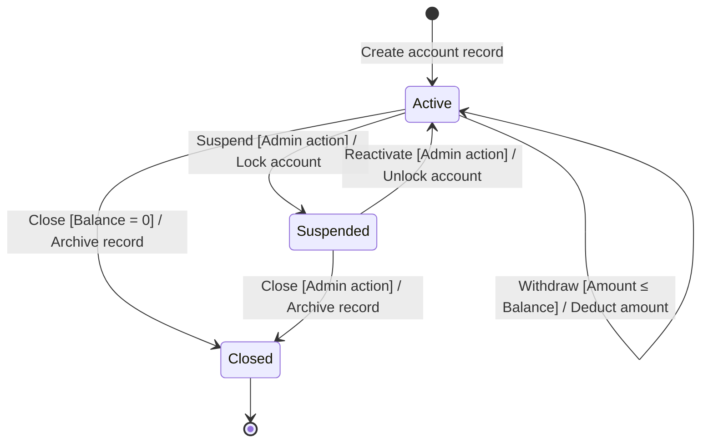

# STD and STT Construction Guide

## Part 1: State Transition Diagram (STD)

### Purpose

The STD is the **visual specification** of the FSM — it communicates the system's valid behavior to all stakeholders. It is constructed before the STT and reviewed with the team before test case derivation begins.

The STD shows only **valid transitions**. Invalid transitions are NOT drawn in the diagram — they are captured in the STT.

### Construction Procedure

**Step 1: Draw all states**

- One node per state (rectangle with rounded corners or circle)
- Label each node with its state name and ID (e.g., "S1: Active")
- Do not draw a node for the initial pseudostate — draw a solid filled circle instead

**Step 2: Draw the initial pseudostate**

- Draw solid filled circle → arrow → first real state
- This arrow has no label (unconditional, no event, no guard)

**Step 3: Draw all final states**

- Use bullseye symbol or double-bordered rectangle
- Draw the transition INTO the final state from its source state

**Step 4: Draw all valid transitions**

- One directed arrow per valid transition
- Label each arrow: `Event [Guard] / Action`
  - Omit Guard if there is no guard condition
  - Omit Action if there is no observable output
- Self-transitions: draw as a looping arrow back to the same node

**Step 5: Verify completeness**

| Check                                           | Pass Condition                                                                                 |
| ----------------------------------------------- | ---------------------------------------------------------------------------------------------- |
| All states reachable                            | Every state can be reached from the initial pseudostate via some sequence of valid transitions |
| No orphan states                                | No state exists that was not in the FSM Component List                                         |
| All non-final states have outgoing transitions  | Every state except final states has at least one outgoing arrow                                |
| No transitions point to the initial pseudostate | Solid filled circle has no incoming arrows                                                     |
| All arrows are fully labeled                    | No unlabeled or partially labeled transitions                                                  |

### Text Representation (Markdown/Plain Text Environments)

When a graphical tool is not available, represent the STD as a **labeled transition list**:

```
STATES: S1 (Active), S2 (Suspended), S3 (Closed)
INITIAL: ● → S1
FINAL: S3

VALID TRANSITIONS:
● → S1  : [unconditional] / Create account record
S1 → S1 : Deposit / Update balance
S1 → S1 : Withdraw [Amount ≤ Balance] / Deduct amount
S1 → S2 : Suspend [Admin action] / Lock account
S1 → S3 : Close [Balance = 0] / Archive record
S2 → S1 : Reactivate [Admin action] / Unlock account
S2 → S3 : Close [Admin action] / Archive record
```

Alternatively, use Mermaid `stateDiagram-v2` syntax for rendered environments:



### Stakeholder Review Checklist

Before proceeding to the STT, verify with at least one stakeholder:

- [ ] All business states are represented — no missing lifecycle phases.
- [ ] All valid transitions are drawn — no missing arrows.
- [ ] All guard conditions are correctly captured — no missing or incorrect conditionals.
- [ ] Final states are correctly identified — no state is incorrectly marked final.
- [ ] Self-transitions are included where the system can receive an event and stay in the same state.
- [ ] The diagram matches the current requirements — no outdated transitions from previous spec versions.

## Part 2: State Transition Table (STT)

### Purpose

The STT converts the STD into an **exhaustive analytical grid** that forces systematic consideration of ALL state × event combinations — including the invalid ones invisible in the diagram. It is the primary source for test case derivation.

→ Use [`output-template.md`](output-template.md) for the recommended format.

### Construction Procedure

**Step 1: Set up the grid**

- **Rows:** one per state (do NOT include the initial pseudostate)
- **Columns:** one per unique event identified across the entire FSM
- Total cells = number of states × number of events

**Step 2: Fill valid transition cells**

- For each valid transition in the STD, find its row (source state) and column (event), and write: `Destination State / Action`
- For valid self-transitions: `Same State / Action`

**Step 3: Fill invalid transition cells**

For every cell not corresponding to a valid transition, determine what the system does:

- `— / "Error: [message]"` — system rejects with specific error
- `— / [no-op]` — system silently ignores the event, no state change, no visible output
- `— / [exception]` — system returns an error code or throws a controlled exception

**Never leave a cell blank.** Blank = undefined behavior = specification gap. If the expected response is unknown, mark as `TBD` and raise with the product owner before proceeding to test case derivation.

**Step 4: Verify the table**

| Check                        | Pass Condition                                                         |
| ---------------------------- | ---------------------------------------------------------------------- |
| Cell count                   | Total cells = states × events                                          |
| No blank cells               | Every cell has a defined entry                                         |
| Valid transition count       | Matches the number of arrows in the STD                                |
| Invalid transition responses | Every invalid cell specifies what the system does — not just "invalid" |
| Self-transitions             | Appear as same state in destination column                             |

### Handling Guard Conditions in the STT

When the same event has multiple guard conditions leading to different destinations, use sub-rows or separate rows for each guard:

| Current State | Event    | Guard            | Valid? | Destination State | Action          |
| ------------- | -------- | ---------------- | ------ | ----------------- | --------------- |
| In Credit     | Withdraw | Amount ≤ Balance | Y      | In Credit         | Deduct amount   |
| In Credit     | Withdraw | Amount > Balance | Y      | Overdrawn         | Apply overdraft |

Both rows share the same "Current State" and "Event" — they are different transitions differentiated by guard.

### Invalid Transition Specification

Each invalid transition cell must specify one of:

| Response Type              | Example                                                            | When to Use                                                          |
| -------------------------- | ------------------------------------------------------------------ | -------------------------------------------------------------------- |
| **Explicit error message** | "Error: Cannot withdraw from closed account"                       | User-facing validation rejection; security boundary                  |
| **Silent no-op**           | Event ignored; no state change; no visible output                  | System design choice for certain non-critical events                 |
| **HTTP / API error code**  | HTTP 409 Conflict; error body: `{code: "INVALID_STATE"}`           | API-level state validation                                           |
| **UI control state**       | Button is disabled in this state; event cannot be triggered via UI | UI-layer prevention (but should still be tested via API/direct call) |

**Important:** "Button is disabled" is NOT a sufficient expected result on its own. The system's backend must also reject the event if it arrives via direct API call or by bypassing the UI. Test both.
